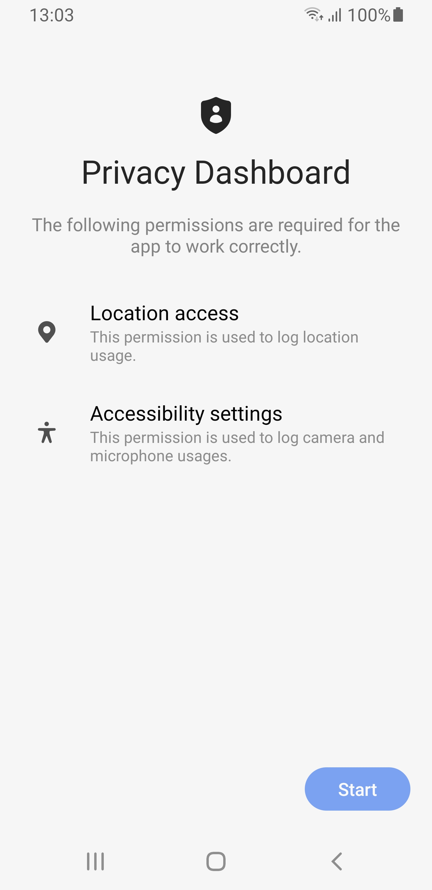
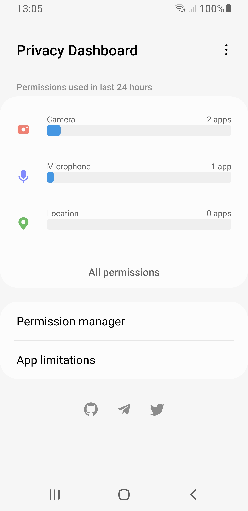
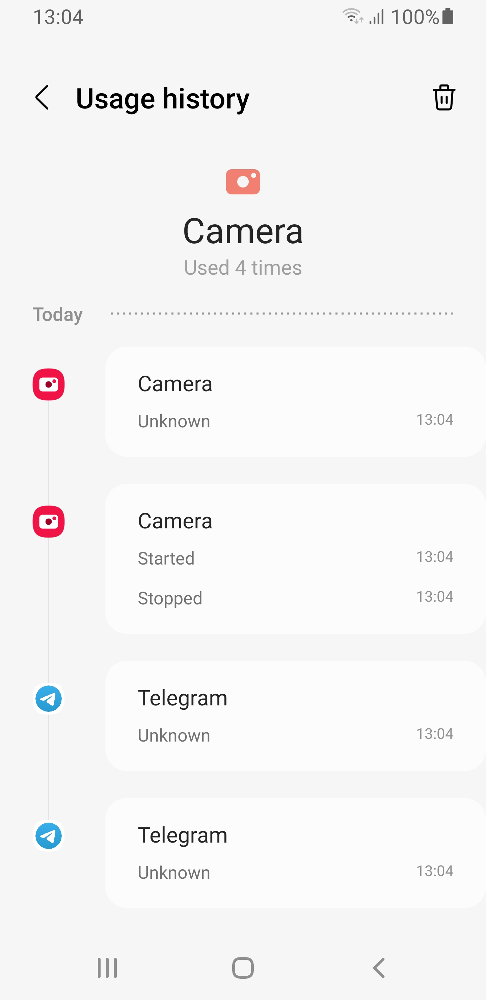
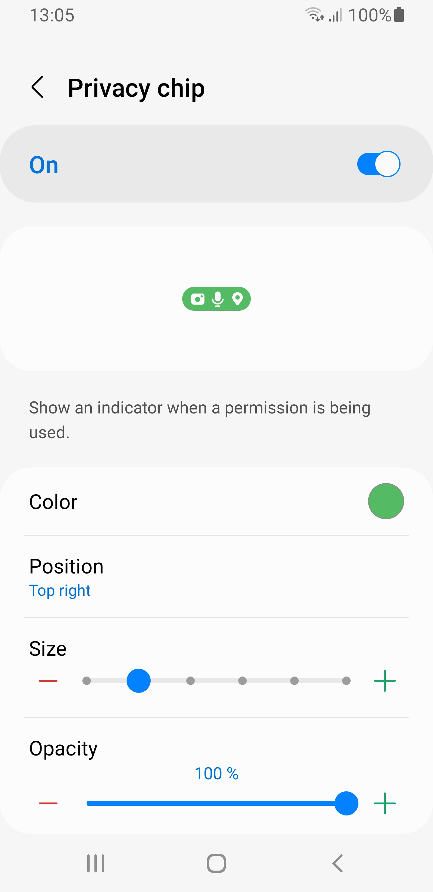
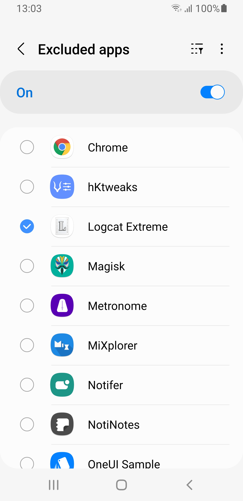

# Privacy Dashboard OneUI
 

This fork is a OneUI styled and modified version of the [Privacy Dashboard app](https://github.com/RushikeshKamewar/PrivacyDashboard) by [Rushikesh Kamewar](https://github.com/RushikeshKamewar). The app mimics the Privacy Dashboard features from Android 12 to bring them to older Android devices (Android 7.0 and up).

Original idea from: [https://github.com/suhan-paradkar/PrivacyDashboard-OneUI](https://github.com/suhan-paradkar/PrivacyDashboard-OneUI)

    

#### The following permissions are required for the app to work correctly:

- Accessibility settings: To get app usages of microphone and camera.
- Location access: To get app usages of location.

## Credits
* Samsung
* [OneUI Design Library](https://github.com/Yanndroid/OneUI-Design-Library)
* [Safe Dot Android](https://github.com/kamaravichow/safe-dot-android)
